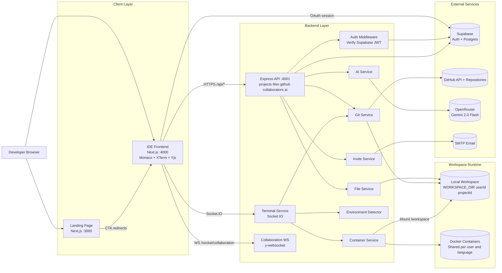

<div align="center">

  # 🚀 Code Forge Hub
  ### A Premium Cloud-Native IDE for the Modern Web

  [](https://github.com/)
  [](https://nextjs.org/)
  [](https://www.typescriptlang.org/)
  [](https://www.docker.com/)
  [](https://supabase.com/)
  [](LICENSE)

  [Features](#-features) • [Architecture](#-architecture) • [Tech Stack](#-tech-stack) • [Quick Start](#-quick-start) • [API](#-api-reference)
</div>

---

## 📖 Introduction

**Code Forge Hub** is a premium, cloud-powered IDE designed to bring the power of VSCode directly to your browser. Whether you're importing a local project or connecting to GitHub, Code Forge Hub provides a seamless, zero-latency development environment with integrated containerization, AI assistance, and real-time collaboration.

## ✨ Features

### 🤖 AI Coding Assistant (New!)
- **🧠 Context-Aware Chat** – Integrated AI assistant that understands your entire project structure.
- **⚡ Smart Autocomplete** – Powered by **Gemini 2.0 Flash**, get real-time code suggestions as you type.
- **📂 Project Intelligence** – The AI can "see" your file tree to help with cross-file logic and refactoring.

### 🚀 Zero-Latency Pipeline
- **🔥 Container Pre-warming** – Containers start the moment you click a project, so they're ready before the IDE loads.
- **🔄 Auto-Push on Exit** – Never lose work. Changes are automatically committed and pushed to GitHub when you disconnect.
- **🧪 Multi-Environment Support** – Intelligent auto-detection for **Node.js, Python, Go, Rust, Java, C++, PHP, and Ruby**.
- **💾 Persistent Workspaces** – Docker containers are automatically reconnected on server restart, preserving your runtime state.

### 🤝 Professional Collaboration
- **👥 Live Multi-cursor** – See exactly where your teammates are coding with beautifully styled, color-coded labels.
- **⚡ Instant Sync** – Conflict-free editing powered by **Yjs CRDTs** for a seamless pairing experience.
- **✉️ Automated Invites** – Invite teammates via email or GitHub username with professional HTML email templates.
- **🟢 Online Presence** – Real-time visual indicators of everyone currently active in the workspace.

### 💻 Premium IDE Experience
- **📁 Pro File Explorer** – Tree-based management with recursive operations, multi-select, and unsaved changes tracking.
- **📝 Monaco Engine** – The same high-performance editor that powers VSCode, with customized themes and shortcuts.
- **🖥️ Real-time PTY Terminal** – Low-latency Linux terminal with full shell support and ANSI color handling.
- **💾 Smart Autosave** – Intelligent, debounced saving logic keeps your focus on the code.

### 🎨 Design & UX
- **🌓 Glassmorphic UI** – A stunning, modern interface with deep transparency, blur effects, and neon accents.
- **📐 Elastic Layout** – Draggable, resizable panels (Sidebar, Terminal, AI) for a custom workspace.
- **✨ Micro-Animations** – Smooth transitions, pulse glows, and floating elements for a premium feel.
- **📱 Fully Responsive** – Desktop-class IDE experience even on tablets and mobile devices.

---

## 🏗️ Architecture



### 🛡️ Scalability & Isolation
Code Forge Hub is built for scale and security:
- **User Isolation**: Every user gets a dedicated Docker container with strict resource limits (512MB RAM, 0.25 CPU).
- **Resource Management**: Projects of the same language share a container per user to optimize memory overhead.
- **Stateless Backend**: The Express.js backend can be horizontally scaled, while Supabase handles persistent state.
- **Robust Git-Sync**: Automated stashing and branch management to handle concurrent edits and safe code recovery.

---

## 🛠️ Tech Stack

| Type | Technology | Logo |
| :--- | :--- | :---: |
| **AI** | OpenRouter, Gemini 2.0 Flash | 🤖 |
| **Frontend** | Next.js 15, Framer Motion, Zustand | ⚛️ |
| **Backend** | Node.js, Express, Socket.io | 🟢 |
| **Terminal** | XTerm.js, Node-PTY | 🐚 |
| **Isolation** | Docker, Dockerode | 🐳 |
| **Cloud** | Supabase, GitHub API | ☁️ |
| **Collab** | Yjs, y-websocket, y-monaco | 🤝 |

---

## 🚀 Quick Start

### 📋 Prerequisites
- **Node.js** 20.x or higher
- **Docker** Desktop / Engine
- **Supabase** Project (URL & Anon Key)
- **GitHub** OAuth Application
- **OpenRouter** API Key (for AI features)
- **SMTP Credentials** (for email invitations)

### ⚙️ Installation

```bash
# 1. Clone the project
git clone https://github.com/user/code-forge-hub.git && cd CodeForge-Hub

# 2. Setup Backend
cd backend && npm install
# Create .env based on .env.example

# 3. Setup Frontend
cd ../frontend && npm install
# Create .env.local based on .env.example

# 4. Setup Landing Page
cd ../landing-page && npm install
```

### ⚡ Execution

For the best experience, run each service in a separate terminal window:

| Service | Command | Port | Title |
| :--- | :--- | :---: | :--- |
| **Backend** | `npm run dev` | `4001` | Core API & Terminal Service |
| **Frontend** | `npm run dev` | `4000` | The IDE Application |
| **Marketing** | `npm run dev` | `3000` | High-Conversion Landing Page |

---

## 📡 API Reference

### 📁 Project Management
- `GET /api/projects` – List all user workspace
- `POST /api/projects` – Import from GitHub
- `POST /api/projects/import` – **Multipart** local file upload
- `POST /api/projects/:id/prewarm` – Trigger background container boot

### 🤖 AI Capabilities
- `POST /api/ai/chat` – Project-aware coding assistant
- `POST /api/ai/autocomplete` – Real-time code suggestions

### 🤝 Collaboration
- `POST /api/collaborators/:projectId/invite` – Send email invitations
- `GET /api/collaborators/:projectId` – List active collaborators

---

## ⌨️ Keyboard Shortcuts

| Key | Description |
| :--- | :--- |
| `Ctrl + S` | Force Save / Sync |
| `Alt + T` | Toggle Terminal Focus |
| `Ctrl + I` | Open AI Assistant |
| `Tab` | Accept AI Autocomplete |
