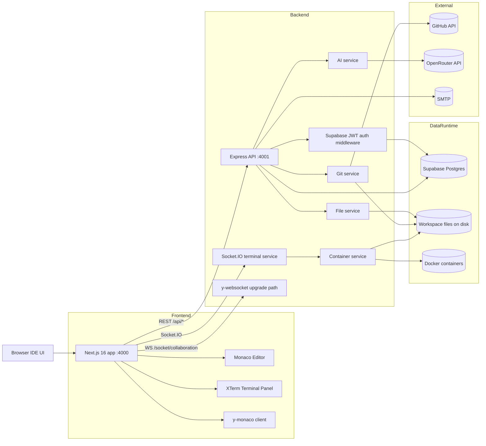
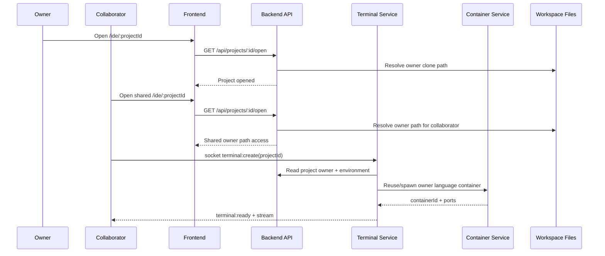
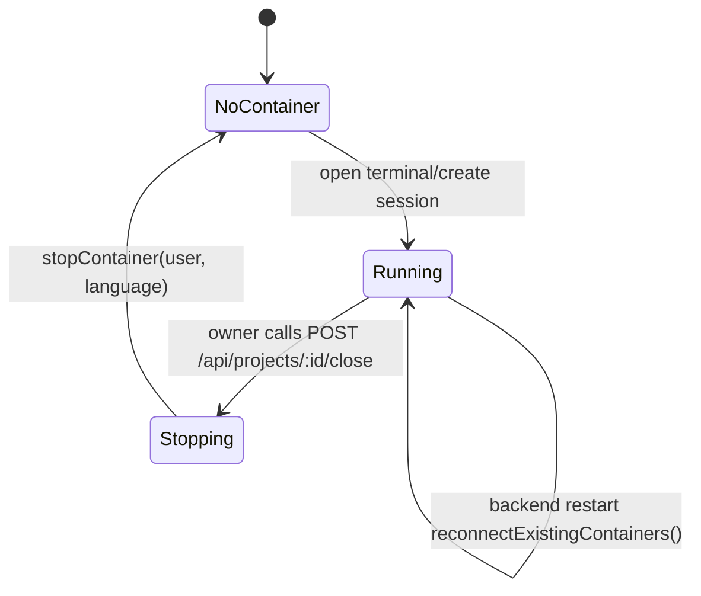

# Code Forge Hub

Cloud IDE with GitHub-backed workspaces, Docker-based language runtimes, real-time collaboration, and an OpenRouter-powered assistant.

## Latest updates

- Collaborator file access now resolves to the project owner's workspace path.
- Terminal sessions for collaborators now reuse/spawn container context using owner-mounted workspace.
- Added `POST /api/projects/:id/close` so owner can close a project and stop language container.
- Save and exit flow now triggers backend close call from IDE.
- AI error handling now returns upstream status/details (including 429) instead of a generic env-key message.
- Backend startup reconnects existing managed containers to reduce container churn.

## Architecture

### System architecture



### Multi-user project open and terminal flow



### Container lifecycle (current behavior)



## Core features

- Browser IDE with Monaco editor, XTerm terminal, and Yjs collaboration.
- GitHub repo import and local-folder import (creates repo + initial push).
- Workspace file operations through authenticated API.
- Docker language environments: python, node, java, go, rust, cpp, php, ruby, base.
- AI chat and autocomplete via OpenRouter.
- Project sharing by invite email and real-time collaborative editing.

## Tech stack

- Frontend: Next.js 16.1.6, React 19.2.3, Zustand, Framer Motion, Monaco, XTerm.
- Backend: Express, Socket.IO, Dockerode, Simple-Git, Multer, Nodemailer.
- Data/Auth: Supabase (JWT verification + project/collaborator tables).
- Collaboration: yjs, y-websocket, y-monaco.
- AI: OpenRouter chat-completions API.

## Monorepo layout

```text
backend/        Express API + Socket.IO + Docker orchestration
frontend/       Main IDE app (Next.js, port 4000)
landing-page/   Marketing site (Next.js, port 3000)
docker/         Dockerfiles and image build scripts
```

## Quick start

### Prerequisites

- Node.js 20+
- Docker Desktop (or Docker Engine)
- Supabase project (URL + service role key)
- GitHub OAuth setup and provider token flow
- OpenRouter API key
- SMTP credentials (for invite emails)

### Install

```bash
git clone <your-repo-url>
cd CodeForge-IDE

cd backend && npm install
cd ../frontend && npm install
cd ../landing-page && npm install
```

### Run locally (3 terminals)

```bash
# terminal 1
cd backend
npm run dev

# terminal 2
cd frontend
npm run dev

# terminal 3
cd landing-page
npm run dev
```

Ports:

- Backend API: `http://localhost:4001`
- Frontend IDE: `http://localhost:4000`
- Landing page: `http://localhost:3000`

## Environment variables

### backend/.env

Required keys used by current code:

- `SUPABASE_URL`
- `SUPABASE_SERVICE_KEY`
- `OPENROUTER_API_KEY`
- `FRONTEND_URL` (optional, default `http://localhost:4000`)
- `PORT` (optional, default `4001`)
- `WORKSPACE_DIR` (optional, defaults under user home)
- `SMTP_USER` and `SMTP_PASS` (for invite email)

### frontend/.env.local

- `NEXT_PUBLIC_API_URL` (typically `http://localhost:4001`)
- Supabase public env vars used by your frontend auth client.

## API reference (current routes)

Health:

- `GET /health`

GitHub:

- `GET /api/github/repos`

Projects:

- `GET /api/projects`
- `POST /api/projects`
- `DELETE /api/projects/:id`
- `GET /api/projects/:id/open`
- `POST /api/projects/:id/close`
- `POST /api/projects/:id/save`
- `POST /api/projects/import`

Files:

- `GET /api/files/tree/:projectId`
- `GET /api/files/:projectId/read`
- `POST /api/files/:projectId/write`
- `POST /api/files/:projectId/create`
- `DELETE /api/files/:projectId/delete`
- `POST /api/files/:projectId/upload`

Collaborators:

- `GET /api/collaborators/:projectId`
- `POST /api/collaborators/:projectId/invite`
- `DELETE /api/collaborators/:projectId/:userId`

AI:

- `POST /api/ai/chat`
- `POST /api/ai/autocomplete`

## Troubleshooting

### AI returns 429

- `429` means OpenRouter rate-limit or quota/credit issue.
- It is not always a missing-key issue.
- Verify billing/usage in OpenRouter, then retry.

### Collaborator terminal disconnect or cwd not found

- Ensure owner has opened the project at least once (owner clone exists).
- Verify container mounts owner workspace and project directory exists.
- Use `POST /api/projects/:id/close` as owner to stop stale language container, then reopen.

### Build check

```bash
cd backend && npm run build
cd frontend && npm run build
```

## Security notes

- Do not commit `.env` files.
- Rotate API keys if they were ever pushed to remote history.
- Keep GitHub provider tokens user-scoped and short-lived.
